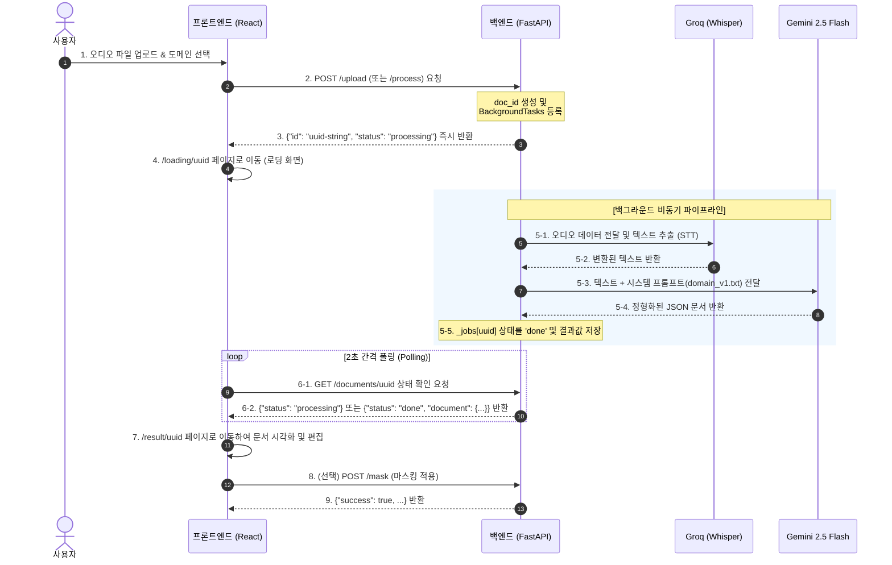

# 온글(On-Geul) 백엔드 기능 및 파일 구조 정리 (Phase 1)

현재 백엔드(FastAPI)와 프론트엔드(React)가 정상적으로 연동되어 작동해야 하는 전체적인 흐름과 각 파일/폴더의 역할을 정리합니다.

---

## 1. 현재 연동 시 정상 작동해야 하는 기능 흐름 (Flow)

오디오 업로드부터 최종 결과 화면까지 다음과 같은 시나리오로 동작합니다.



### 테스트용 환경 변수 (.env) 조합
*   **완전 DUMMY 테스트:** `.env`에 `DUMMY_MODE=true`, `DUMMY_STT=true`를 설정하면 Groq 및 Gemini 실제 API 호출 없이 **1초 이내**에 더미 변환 및 문서 결과로 폴링이 완료되어 전체 프론트엔드 연동 테스트를 신속하게 할 수 있습니다.
*   **실제 테스트:** `DUMMY_MODE=false`, `DUMMY_STT=false` 설정 후 `GEMINI_API_KEY`와 `GROQ_API_KEY`를 설정하여 실제 변환을 수행합니다.

---

## 2. 백엔드 파일 및 폴더 설명 (.py 파일 가이드)

### 📂 프로젝트 전체 디렉토리 구조
```
backend/
├── main.py                 # 백엔드 진입점
├── requirements.txt        # 패키지 의존성 파일
├── test_llm.py             # LLM 단독 동작 테스트 스크립트
├── models/
│   └── schemas.py          # Pydantic 데이터 모델 (카멜케이스 설정 포함)
├── routers/
│   ├── process.py          # 메인 비동기 파이프라인 (/process, /upload)
│   ├── documents.py        # 문서 관리 및 폴링 (/documents/{id})
│   ├── mask.py             # 개인정보 마스킹 (/mask)
│   ├── transcribe.py       # STT 변환 단독 API (/transcribe)
│   ├── schedule.py         # Google 캘린더 연동 (Phase 2)
│   ├── notify.py           # Slack 알림 발송 (Phase 2)
│   └── graph.py            # Neo4j 지식그래프 연동 (Phase 3)
└── services/
    ├── stt.py              # Groq Whisper API 래퍼
    ├── llm.py              # Gemini API / LangChain 연동 래퍼
    ├── firebase.py         # Firebase Realtime DB 연동 (Phase 2)
    ├── calendar.py         # Google Calendar OAuth 연동 (Phase 2)
    └── neo4j_db.py         # Neo4j AuraDB 연동 (Phase 3)
```

### 📄 주요 파일 설명

#### 1) 엔트리 및 공통 파일
*   **`main.py`**
    *   FastAPI 인스턴스를 생성하고 모든 `router`들을 등록합니다.
    *   CORS 설정을 통해 프론트엔드와의 교차 출처 리소스 공유를 제어합니다.
    *   프론트엔드 에러 처리를 돕기 위해 전역 `HTTPException` 핸들러를 장착하여 모든 에러 응답 구조를 `{"message": "에러내용"}` 형태로 자동 변환해 줍니다.
*   **`models/schemas.py`**
    *   Pydantic을 이용하여 데이터의 유효성을 검증하고 JSON 직렬화 구조를 선언합니다.
    *   프론트엔드와 백엔드 간의 명명 규칙(CamelCase ↔ snake_case) 불일치를 해결하기 위해 `alias_generator=to_camel` 설정을 포함한 기본 클래스를 제공합니다.

#### 2) `routers/` (API 컨트롤러 레이어)
*   **`routers/process.py`**
    *   사용자의 오디오 파일을 수신하고 즉시 고유 UUID 및 대기 중 상태를 반환합니다.
    *   STT와 LLM을 순차적으로 수행하는 비동기 백그라운드 태스크(`_run_pipeline`)를 트리거합니다.
*   **`routers/documents.py`**
    *   로딩 화면에서 주기적으로 호출하는 `GET /documents/{doc_id}`를 통해 백그라운드 태스크의 현재 진행 현황("processing" | "done" | "error")을 반환합니다.
*   **`routers/mask.py`**
    *   Phase 1 기준 프론트엔드 클라이언트 사이드 마스킹 결과를 바탕으로 가상 성공 응답(`{success: true}`)을 던져주며, Phase 2에서 백엔드 개체명 인식(NER) 및 정규식 마스킹 파이프라인으로 업그레이드될 예정입니다.
*   **`routers/transcribe.py`**
    *   오디오 파일을 텍스트로 단순 변환하는 개별 엔드포인트(`POST /transcribe`)입니다.

#### 3) `services/` (비즈니스 로직 / 외부 API 연동 레이어)
*   **`services/stt.py`**
    *   Groq의 `whisper-large-v3-turbo` 모델을 호출하여 오디오 데이터에서 한국어 텍스트를 추출합니다. 25MB 이하의 제한 사항과 파일 확장자 검증을 수행합니다.
*   **`services/llm.py`**
    *   LangChain과 Google AI Studio의 `gemini-2.5-flash` 모델을 사용하여 대화 스크립트를 정형화된 JSON 형태의 회의록/문서 구조로 작성합니다.
    *   출력 JSON 포맷 파싱에 실패할 경우 최대 3회 재시도를 수행합니다.
    *   오늘 날짜를 시스템 프롬프트에 자동으로 주입하여 'dueDate' 등의 상대 날짜를 정확한 절대 날짜(ISO)로 변환해 줍니다.


백엔드 실행 
cd backend
python -m venv venv
.\venv\Scripts\Activate.ps1

pip install -r requirements.txt
